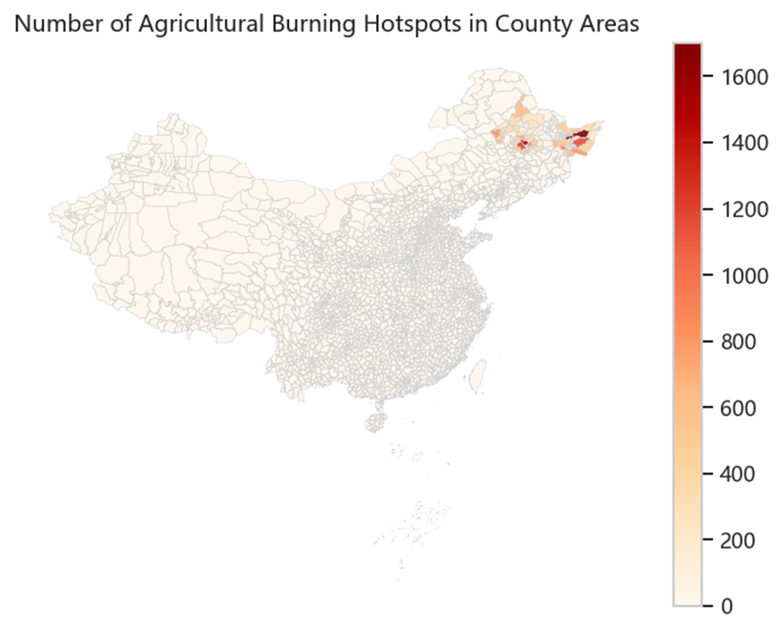
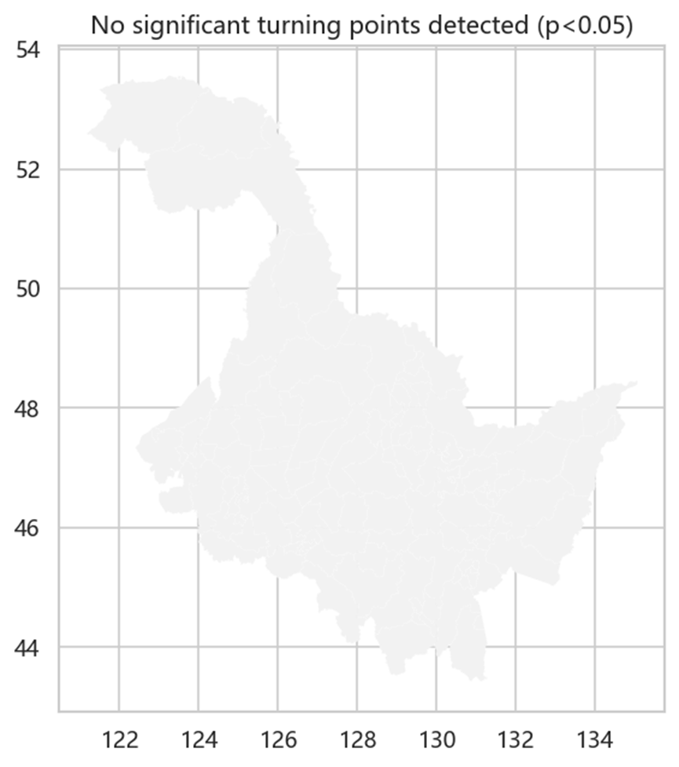

# 图片汇总（Image Summary）
## Task 1 相关图片

.png)

.png)
.png)
.png)
.png)
.png)
.png)
.png)
.png)
.png)

## Task 2 相关图片
.png)
.png)
.png)

## Task 3 相关图片
.png)

.png)
.png)

## Task 4 相关图片

## Challenge 1 相关图片

.png)
.png)

## Challenge 3 相关图片

