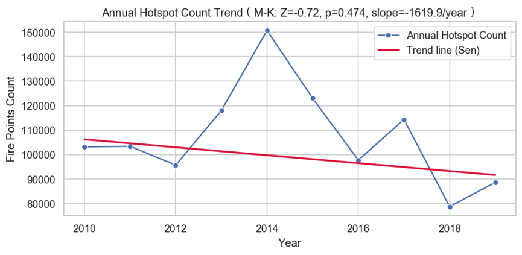
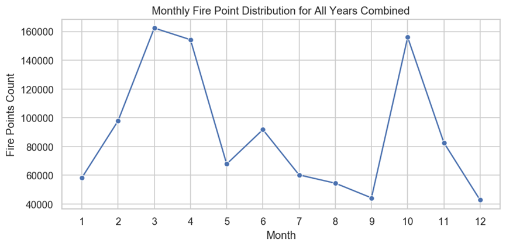
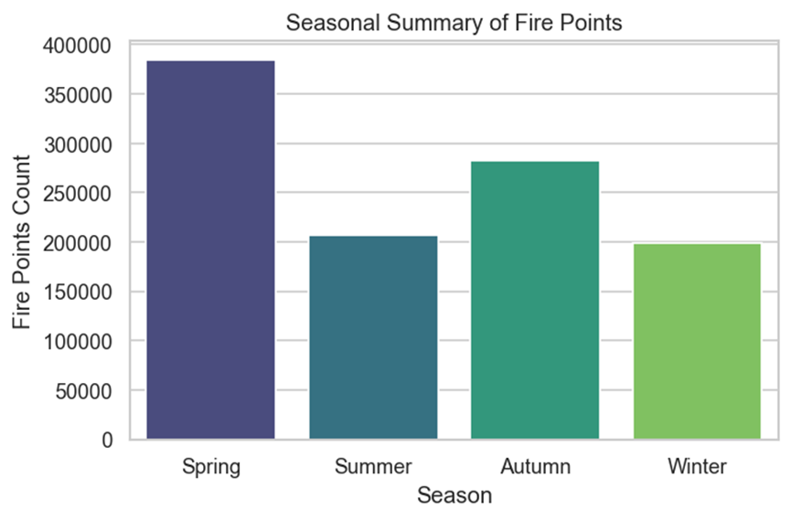
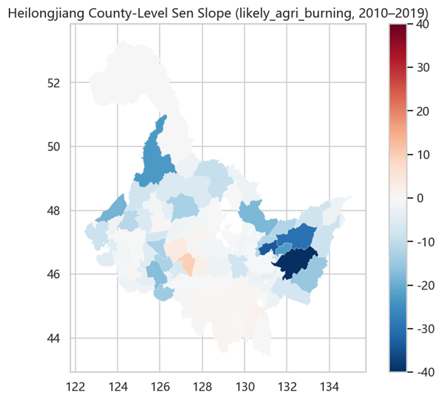
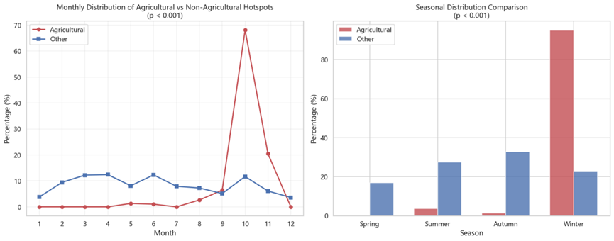

# 图片汇总（Image Summary）

## Task1 图片

.png)

.png)
.png)
.png)
.png)
.png)
.png)
.png)
.png)
.png)

## Task2 图片
.png)
.png)
.png)

## Task3 图片
.png)

.png)
.png)

## Task4 图片

## Challenge 1 图片

.png)
.png)

## Challenge 3 图片

