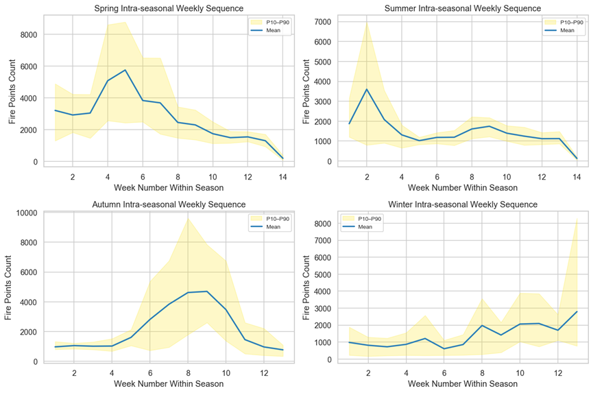
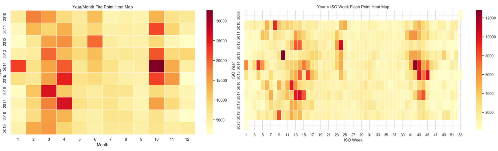
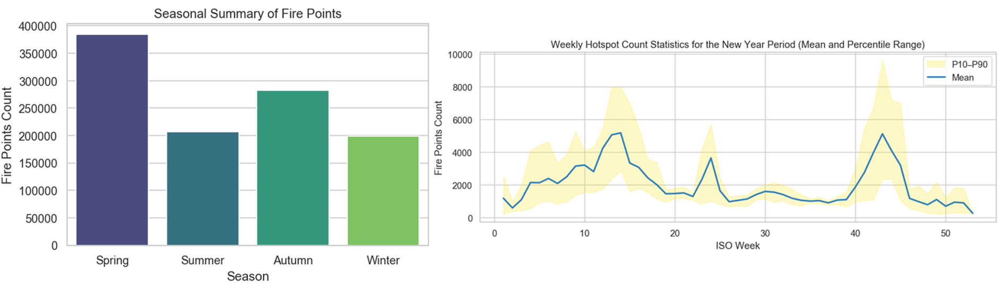
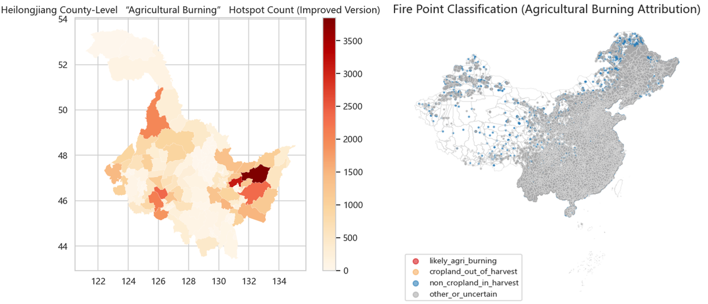
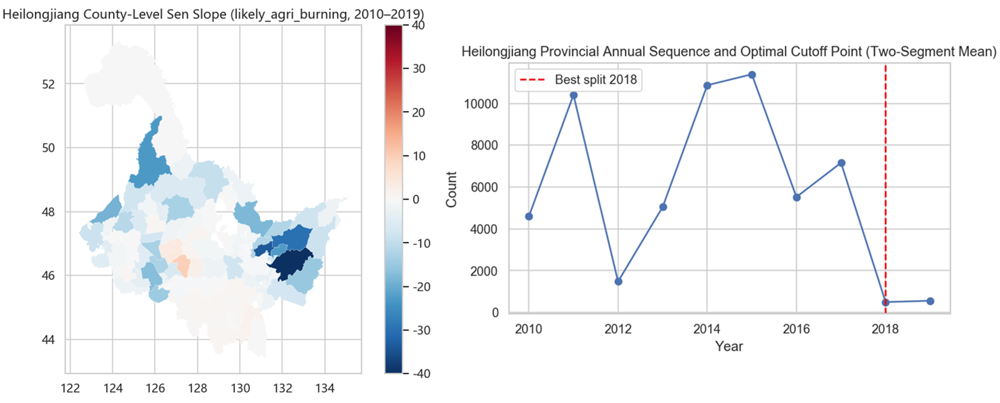
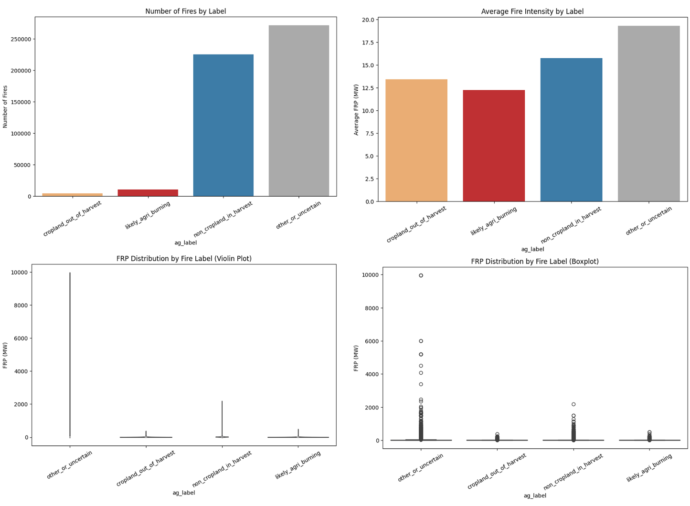
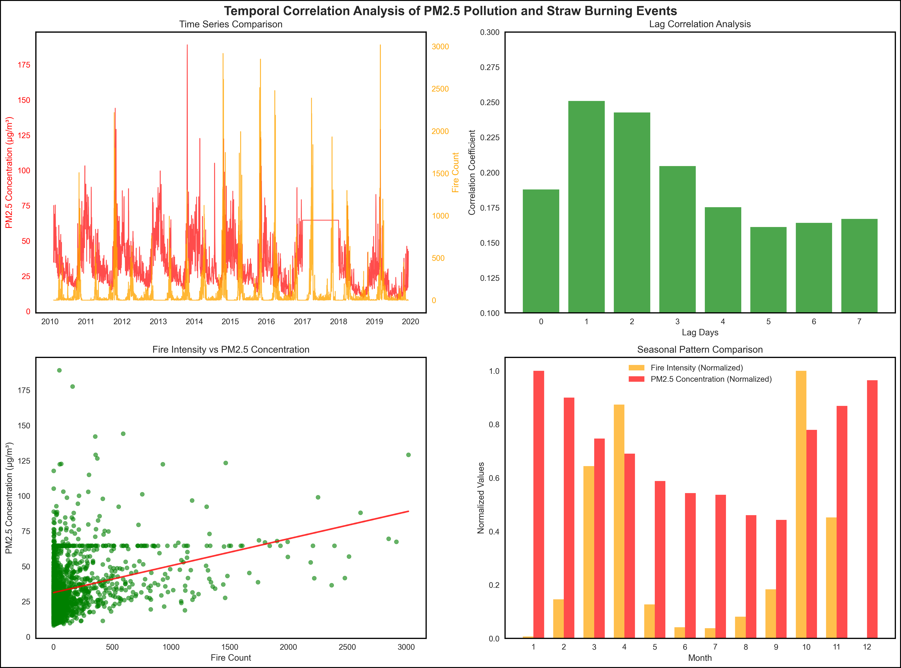

# Course5020Project
This repository was established to complete the course assignment, which is a mini group project of the **Environmental Modeling and Big Data Analysis** course, proposed by **Prof. Luoye Chen**. 

The slogan of our team are as follows:  
`5020,有手就行`  
`Fifty-Twenty, Easy-Peasy`

The members of our team are as follows:
`Kaibiao ZHU, Junye ZHONG, Hongyue WU, Yueting ZHANG `

---

## Setup Environment

Use `conda` to create a reproducible environment:

1. Create environment with a specific python version.

```bash
conda create -n course5020 python=3.11 -y
conda activate course5020
```

2. Install pip and project dependencies.

```
conda install pip -y
pip install --upgrade pip
pip install -r requirements.txt
pip install ipykernel
```
Notes：
- The dataset is moderately large. When conducting the annual summary operation, please ensure that you have sufficient memory (recommending more than 8GB) and sufficient time - it may take up to two hours.

## Dataset

All raw data used in this project should be placed under the `raw_data` folder. The details of all the dataset are as follows:

-  For the part of core tasks, the dataset is already presented in the `raw_data` folder.
-  For the part of challenge, you can get the dataset by sending an email to author.

Notes about missing years
- The provided PM2.5 dataset has no 2017 file this project handles that gracefully during preprocessing but if you have 2017 data, add it to `raw_data/specific_data/` with the same naming convention (eg: HLJ_2017_PM2.5.csv)


## Project Structure
```
course5020-project
    ├── docs
    ├── raw_data
    ├── results
    │   ├── challenge3
    │   ├── task1
    │   ├── task2
    │   ├── task3
    │   └── task4
    ├── src
    │   ├── challenge1.ipynb
    │   ├── challenge2.pdf
    │   ├── challenge3.1.ipynb
    │   ├── challenge3.2.ipynb
    │   ├── main.ipynb
    ├── LICENSE
    ├── README.md
    └── requirements.txt  
```

## Running the project
You can enter the following code in the terminal to run the main program：
```
cd src
python main.py  
python challenge1.ipynb
python challenge3.1.ipynb
python challenge3.2.ipynb
```

Quick tips for running notebooks：

- Use JupyterLab or Jupyter Notebook to open the .ipynb files and run cells interactively.

## Overview of project
### Introduction
>Heilongjiang, as a major grain-producing region in China, experiences widespread burning of crop residues after each harvest season. The dense smoke from these agricultural fires not only causes local air pollution but can also be transported over long distances, impacting urban air quality. In this project, we use satellite-detected fire data from 2010–2019, combined with agricultural cropping and meteorological information, to systematically analyze the scale, spatiotemporal characteristics, and trends of open straw burning in Heilongjiang Province. We also evaluate the effectiveness of policy interventions and discuss future improvements. Through analysis of fire activity patterns, identification and classification of fires related to farming, long-term trend tests, and examination of fire characteristics in relation to weather conditions.
### Research Methodology
>In data preprocessing, we filtered the MODIS fire records to extract those within Heilongjiang Province, unified the coordinate reference system, and created a comprehensive GeoDataFrame containing each fire’s latitude, longitude, timestamp, and county location. For each analysis task, we applied appropriate methods such as time series analysis, spatial hotspot mapping, farmland buffer filtering, and statistical tests, alongside visualizations (time-series plots, heatmaps, 
spatial distribution maps) to clearly present the results. In the following sections, Tasks 1-4 and Challenge 1–3 are addressed sequentially, with detailed explanations of the research methods, key steps, main findings and interpretations, and corresponding recommendations.
### Core Task 1: Spatiotemporal Patterns of Fire Activity
#### Solution
Based on fire data from 2010–2019, we conducted a comprehensive spatiotemporal analysis through the following approaches:

- Step1: Temporal aggregation: Analyzed fire data by month, season, and week of year, generating time-series curves and annual-month heatmaps to identify peak fire activity periods.
- Step2: Spatial distribution mapping: Calculated fire counts across regions using county boundary data and produced fire density maps to detect geographical hotspots.
- Step3: Intra-seasonal pattern examination: Investigated weekly fire counts (by ISO week number) to identify specific weeks with significantly increased fire activity.
- Step4: Agricultural correlation assessment: Compared multi-year average fire counts with the crop growth calendar to evaluate whether fire seasonality corresponds with agricultural cycles.harvest cycles.
#### Findings
- Finding 1: Fire activity in Heilongjiang exhibits a distinct bimodal seasonal pattern, with primary peaks occurring during spring (March–April) and autumn (October), each reaching approximately 160,000 fire points per month, while winter (January) and the pre-/post-harvest months (September, December) show significantly lower activity.
- Finding 2: Spatially, fires are heavily concentrated in the northeastern agricultural region, including major crop-producing areas of Heilongjiang, Jilin, and eastern Inner Mongolia, with notable clustering observed around Harbin, Suihua, and Qiqihar, indicating a strong link to straw burning practices.
- Finding 3: Weekly analysis reveals that fire activity is concentrated in ISO weeks 10–20 (mid-March to May) and weeks 40–50 (October to mid-November), with week 45 (late October) representing the annual peak, averaging around 5,000 fires.
- Finding 4: The spatiotemporal distribution—characterized as "concentrated regions, concentrated seasons"—closely aligns with the local agricultural calendar, where spring and autumn peaks correspond to field-preparation and post-harvest straw disposal, respectively, with minimal fire incidence in non-agricultural areas.

**To explain our findings more clearly, we have generated visual images of all the results as follows:**







### Core Task 2: Identification and Classification of Agricultural Fires
#### Solution

- Step 1: A dual-criteria approach ("space + time") was established to classify fire points as likely agricultural burning, requiring simultaneous satisfaction of both spatial (on/near cropland) and temporal (within harvest season) conditions.
- Step 2: Spatial matching was performed using cropland distribution data (1 km raster), identifying fire points located on cropland pixels or within a 500-meter buffer of farmland as farmland-related.
- Step 3: Temporal filtering was applied based on regional crop phenology, defining harvest windows as early August to early September for spring wheat and late September to early November for corn, with adjustments for regional variations.
- Step 4: Each fire point was classified into one of four categories: (1) Likely Agricultural Burning, (2) Cropland Fire – Off-season, (3) Non-cropland Fire – In Harvest Season, or (4) Other/Uncertain.
- Step 5: Quantitative analysis was conducted by calculating the number and proportion of fires in each category, supported by maps and summary tables to estimate the scale of straw burning.
- Step 6: Validation was performed through cross-referencing with the late-2016 FY satellite straw fire dataset to verify the accuracy of the classification rules against field-validated straw burning events.
This structured approach ensures a systematic and reproducible methodology for identifying agricultural burning sources.
#### Findings
- Finding 1: In Heilongjiang Province, agriculturally linked fires are far more significant: 27.8% of 206,929 total fires were classified as “likely agricultural burning,” meaning over one in four fires is directly associated with post-harvest straw burning.
- Finding 2: Spatially, “likely agricultural burning” points are strongly clustered in major grain-producing regions of Heilongjiang—such as the Harbin area, Songnen Plain, and Sanjiang Plain—consistent with intensive crop cultivation and straw disposal practices.
- Finding 3: Additional fire categories reveal nuanced patterns: ∼33.6% of fires occurred on cropland outside harvest seasons (potentially spring burning), and ∼17.0% occurred during harvest seasons but outside mapped cropland (e.g., straw piles burned near fields).
- Finding 4: The classification method effectively identifies straw burning hotspots but has limitations in capturing edge cases such as off-field burning, highlighting a need for rule refinement in subsequent analyses.
- Finding 5: Overall, the results quantitatively confirm that open agricultural straw burning constitutes a substantial portion of fire activity in Heilongjiang, establishing a baseline for assessing the scale and impact of straw burning.

**To explain our findings more clearly, we have generated visual images of all the results as follows:**


### Core Task 3: Long-Term Trends in Fire Activity, 2010–2019
#### Solution
- Step 1: Compiled annual time-series data of "likely agricultural burning" fire counts in Heilongjiang from 2010 to 2019 as the foundation for temporal change analysis.
- Step 2: Conducted preliminary trend assessment through linear regression slope calculation and visual inspection of annual fire count plots to determine overall trend direction.
- Step 3: Applied the Mann-Kendall rank test to evaluate the statistical significance of observed trends, testing against the null hypothesis of no monotonic trend.
- Step 4: Quantified the magnitude of temporal changes using Sen's slope estimator to compute the median annual rate of change in fire counts.
- Step 5: Performed spatial heterogeneity analysis by calculating county-level Sen's slope estimates to identify regional variations in fire trend patterns.
- Step 6: Implemented the Pettitt test to detect significant change-points in the time series, identifying potential structural breaks in fire occurrence patterns.
- Step 7: Executed all analyses at both provincial and county levels to enable comprehensive assessment of overall trends and regional differentiation in fire reduction outcomes.
#### Findings
- Finding 1: Total fire counts in Heilongjiang during the 2010s followed a "rise-then-fall" pattern, peaking around 2014 (~150,000 fires) before declining, though the Mann–Kendall test indicated no statistically significant monotonic trend (Z ≈ -0.72, p ≈ 0.47).
- Finding 2: Agricultural burning fires displayed high interannual variability, rising from ~4,600 in 2010 to a peak of ~11,000 in 2015, then dropping sharply after 2016 and plummeting to ~500 fires annually in 2018–2019, reflecting a cliff-like reduction post-2015.
- Finding 3: Despite the marked decline after 2015, neither the Mann–Kendall test nor the Pettitt test detected a statistically significant trend or change-point at the provincial level, largely due to high early variability.
- Finding 4: Spatially, Sen’s slope analysis revealed widespread declining trends across most counties, with the most rapid reductions (up to ~40 fewer fires/year) observed in eastern agricultural regions such as the Sanjiang Plain.
- Finding 5: County-level change-point tests seldom identified statistically significant breaks, yet a notable inflection period around 2017–2018 was evident in the trend curve, with fire counts dropping to less than 10% of peak levels thereafter.
- Finding 6: The overall reduction in agricultural fires, particularly post-2015, aligns temporally with the implementation of straw burning policy interventions, suggesting their potential influence despite the absence of formal statistical significance in trend tests.

**To explain our findings more clearly, we have generated visual images of all the results as follows:**




### Core Task 4: Differences Between Agricultural and Other Fires Methodology
#### Solution
- Step 1: Integrated satellite-derived Fire Radiative Power (FRP) values from raw MODIS data into the classified fire dataset to enable intensity comparsions between agricultural and non-agricultural fire categories.
- Step 2: Calculated descriptive statistics (mean, median, and distribution range) of FRP values separately for agricultural fires and non-agricultural fires to characterize their intensity profiles.
- Step 3: Performed Mann-Whitney U tests to determine whether observed intensity differences between agricultural and non-agricultural fires were statistically significant.
- Step 4: Generated visual comparsions through boxplots and kernel density curves to illustrate the distribution characteristics of FRP values across different fire categories.
- Step 5: Conducted temporal distribution analysis by aggregating fire counts by month and season for each category, and computed proportional differences to identify seasonal patterns.
- Step 6: Applied chi-square tests to assess the statistical significance of temporal distribution differences between agricultural and non-agricultural fires.
- Step 7: Synthesized quantitative results and visualizations to identify distinctive attributes of agricultural fires in both energy release characteristics and seasonal timing patterns.
#### Findings
- Finding 1: Agricultural fires exhibited moderate intensity levels, with mean FRP values of 12–17 MW, slightly lower than non-agricultural fires (mean: 19.3 MW), and demonstrated a more concentrated distribution in the low-to-medium intensity range with fewer high-intensity outliers.
- Finding 2: The Mann-Whitney U test confirmed statistically significant differences in FRP distributions between agricultural and non-agricultural fires (p ≈ 0.000), though the practical magnitude of intensity difference was relatively small.
- Finding 3: Agricultural fires displayed strong seasonal concentration, occurring predominantly in spring and autumn with peak activity during September-November, while non-agricultural fires were distributed throughout the year, including summer and winter months.
- Finding 4: Chi-square testing revealed highly significant differences in monthly distribution patterns between the two fire types (p ≪ 0.01), confirming the distinct temporal characteristics of agricultural burning.
- Finding 5: Despite their moderate individual intensity, agricultural fires often occur in clustered patterns within short timeframes, potentially generating cumulative environmental impacts that outweigh their per-fire energy contribution.
- Finding 6: In terms of total energy budget, agricultural fires constitute only a minor portion of overall fire energy release due to their relatively small proportion of total fire counts and moderate intensity levels.

**To explain our findings more clearly, we have generated visual images of all the results as follows:**


### Challenge 1: Intensity and lmpact Analysis
#### Solution
- Step 1: Utilized Fire Radiative Power (FRP) data from MODIS fire products to analyze and compare the intensity characteristics of agricultural fires relative to other fire types.
- Step 2: Adopted the same four fire classification categories established in Task 2: (1) Likely Agricultural Burning, (2) Cropland Fire – Off-season, (3) Non-cropland Fire – In Harvest Season, and (4) Other/Uncertain fires.
- Step 3: Computed descriptive statistical metrics for each fire category, including fire count, mean FRP, median FRP, standard deviation, and total estimated fire energy (calculated as fire count multiplied by mean FRP).
- Step 4: Generated comparative visualizations including boxplots and violin plots to analyze FRP distribution patterns across different fire categories.
- Step 5: Employed bar charts to compare both fire counts and average intensity differences among the four classification categories, enabling comprehensive inter-category comparisons.
#### Findings
- Finding 1: Agricultural fires (including both off-season cropland fires and likely agricultural burning) were relatively infrequent, collectively accounting for only approximately 4% of total fire incidents (10,583 and 13,288 cases, respectively).
- Finding 2: The average fire intensity (FRP) of agricultural fires was approximately 17 MW, slightly higher than non-cropland fires during harvest season (15 MW) but comparable to other/uncertain fire types (17 MW).
- Finding 3: Median fire intensity for agricultural fires ranged between 10.8–11.4 MW, indicating that most events were of low-to-medium intensity, with a few high-intensity outliers influencing the mean values.
- Finding 4: Non-agricultural fires demonstrated greater variability in intensity, evidenced by larger standard deviations and wider distribution ranges in FRP values.
- Finding 5: Despite their slightly higher average intensity, agricultural fires contributed only a minimal proportion to the total fire radiative energy budget due to their limited numerical prevalence.
  
**To explain our findings more clearly, we have generated visual images of all the results as follows:**




### Challenge 2: Methodological Limitations and Uncertainty Discussion
#### Conclusion
- Conclusion 1: The agricultural fire classification method based on "space + time" dual criteria revealed significant limitations, with fundamental errors arising from 1km resolution cropland data and fixed harvest time windows, resulting in 10%-15% misclassification rates in transitional zones.
- Conclusion 2: Key uncertainty sources included unupdated cropland data failing to reflect land-use changes (2010-2019), fixed harvest windows ignoring interannual climate variations, and MODIS detection limitations missing 20%-30% of nighttime burning events.
- Conclusion 3: Classification inaccuracies led to substantial estimation biases: national "likely agricultural burning" proportion (2.45%) potentially varied by ±1.2%, with spatial distribution distortions and temporal trend misinterpretations reducing estimated decline trends by 10%-15%.
- Conclusion 4: Implementation of CLCD (30m annual land cover data) significantly improves classification accuracy through refined spatial matching (reducing errors to 2%-3%), dynamic harvest window adjustment, and better identification of off-field burning near agricultural areas.
- Conclusion 5: The optimized approach using CLCD recovers 3%-5% previously misclassified agricultural fires and enhances classification accuracy from 70%-80% to 85%-90%, providing more reliable spatial distribution mapping and temporal trend analysis for straw burning management.

### Challenge 3: Meteorology & Pollution
#### Solution
- Step 1: Analyze the influence of meteorological conditions (wind speed, atmospheric stability, humidity, precipitation, and cloud cover) on fire detection accuracy and smoke dispersion patterns using satellite thermal data and weather records.
- Step 2: Correlate temporal peaks in air pollutant concentrations (PM2.5/PM10) with straw burning periods through time-series comparsion of daily monitoring station data and satellite fire counts.

#### Findings
- Finding 1: Meteorological conditions significantly influence both fire detection and pollution impact, with wind speed determining smoke dispersion patterns and temperature inversions leading to severe local pollution accumulation, particularly during autumn and winter in Northeast China.
- Finding 2: Straw burning substantially elevates particulate matter concentrations, with existing studies estimating an average increase of approximately 27 μg/m³ in autumn PM2.5 levels in Northeast China during high-fire periods.
- Finding 3: Implementation of comprehensive burn bans produces measurable air quality improvements, as evidenced by nearly 50% reduction in peak autumn PM2.5 levels in Heilongjiang following the 2018 policy intervention.
- Finding 4: Weather conditions affect fire classification accuracy, with windy conditions potentially causing agricultural fires to be misclassified as non-cropland fires due to boundary spread, while cloud cover can obscure satellite detection of fires.


**To explain our findings more clearly, we have generated visual images of all the results as follows:**





## Contact and Citation
- If you want to contact the auther, please send an email to `kzhu597@connect.hkust-gz.edu.cn`.  

- If you find this project useful, please cite it as follows:

```
@misc{zhu2025investigating,
      title={Investigating Agricultural Burning with Remote Sensing Data}, 
      author={Kaibiao Zhu and Junye Zhong and Hongyue Wu and Yueting Zhang},
      year={2025},
      url={https://github.com/George-hardworking/course5020-project},
      note={GitHub repository},
}
```


