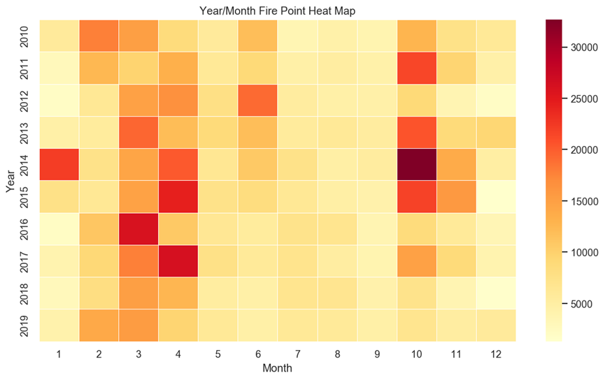
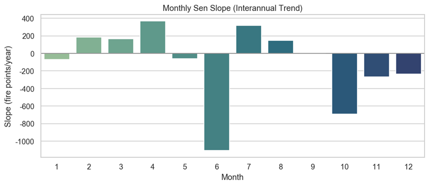
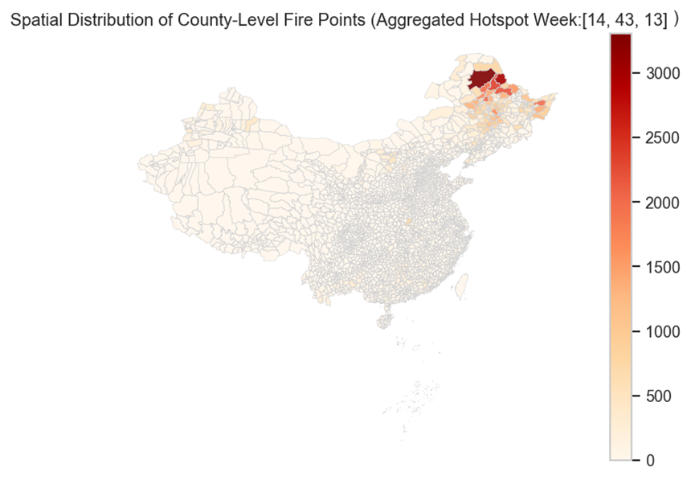
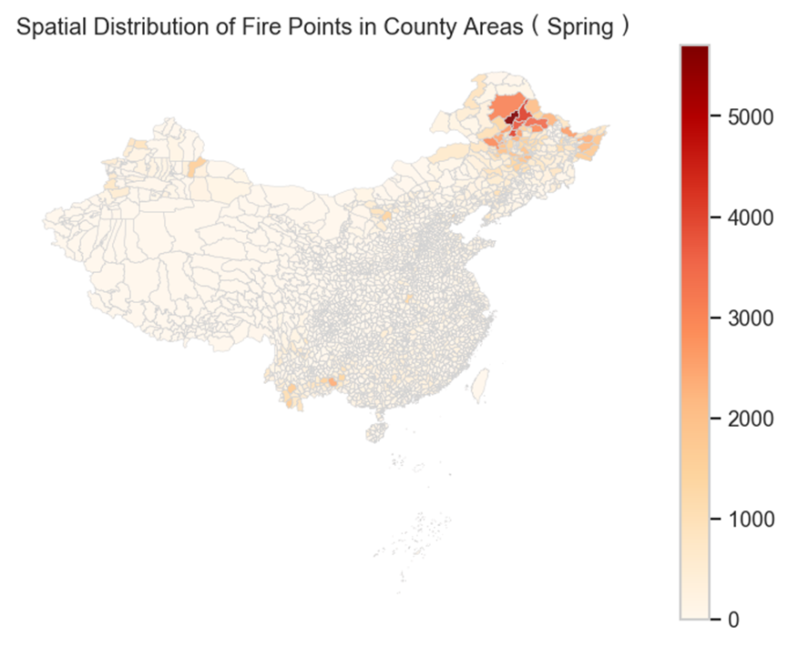
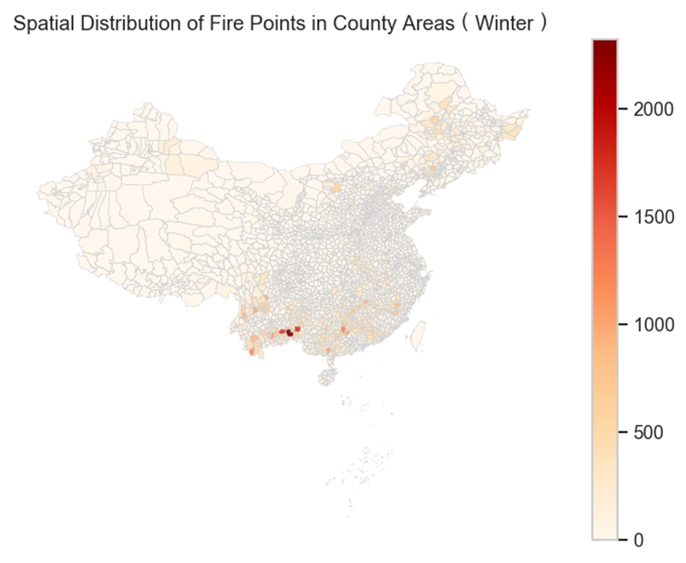

# Course5020Project
This repository was established to complete the course assignment, which is a mini group project of the **Environmental Modeling and Big Data Analysis** course, proposed by **Prof. Luoye Chen**. 

The members of our team are as follows:
`Kaibiao ZHU, Junye ZHONG, Hongyue WU, Yueting ZHANG `

---

## Setup Environment

Use `conda` to create a reproducible environment:

1. Create environment with a specific python version.

```bash
conda create -n course5020 python=3.11 -y
conda activate course5020
```

2. Install pip and project dependencies.

```
conda install pip -y
pip install --upgrade pip
pip install -r requirements.txt
pip install ipykernel
```
Notes：
- The dataset is moderately large. When conducting the annual summary operation, please ensure that you have sufficient memory (recommending more than 8GB) and sufficient time - it may take up to two hours.

## Dataset

All raw data used in this project should be placed under the `raw_data` folder. The details of all the dataset are as follows:

-  For the part of core tasks, the dataset is already presented in the `raw_data` folder.
-  For the part of challenge, you can get the dataset by sending an email to author.

Notes about missing years
- The provided PM2.5 dataset has no 2017 file this project handles that gracefully during preprocessing but if you have 2017 data, add it to `raw_data/specific_data/` with the same naming convention (eg: HLJ_2017_PM2.5.csv)


## Project Structure
```
course5020-project
    ├── docs
    ├── raw_data
    ├── results
    │   ├── challenge3
    │   ├── task1
    │   ├── task2
    │   ├── task3
    │   └── task4
    ├── src
    │   ├── challenge1.ipynb
    │   ├── challenge3.1.ipynb
    │   ├── challenge3.2.ipynb
    │   ├── main_self.ipynb
    │   └── main_self_eng.ipynb
    ├── LICENSE
    ├── README.md
    └── requirements.txt  
```

## Running the project
You can enter the following code in the terminal to run the main program：
```
cd src
python main.py  
python challenge1.ipynb
python challenge3.1.ipynb
python challenge3.2.ipynb
```

Quick tips for running notebooks：

- Use JupyterLab or Jupyter Notebook to open the .ipynb files and run cells interactively.

## Overview of project
### Introduction
>Heilongjiang, as a major grain-producing region in China, experiences widespread burning of crop residues after each harvest season. The dense smoke from these agricultural fires not only causes local air pollution but can also be transported over long distances, impacting urban air quality. In this project, we use satellite-detected fire data from 2010–2019, combined with agricultural cropping and meteorological information, to systematically analyze the scale, spatiotemporal characteristics, and trends of open straw burning in Heilongjiang Province. We also evaluate the effectiveness of policy interventions and discuss future improvements. Through analysis of fire activity patterns, identification and classification of fires related to farming, long-term trend tests, and examination of fire characteristics in relation to weather conditions.
### Research Methodology
>In data preprocessing, we filtered the MODIS fire records to extract those within Heilongjiang Province, unified the coordinate reference system, and created a comprehensive GeoDataFrame containing each fire’s latitude, longitude, timestamp, and county location. For each analysis task, we applied appropriate methods such as time series analysis, spatial hotspot mapping, farmland buffer filtering, and statistical tests, alongside visualizations (time-series plots, heatmaps, 
spatial distribution maps) to clearly present the results. In the following sections, Tasks 1-4 and Challenge 1–3 are addressed sequentially, with detailed explanations of the research methods, key steps, main findings and interpretations, and corresponding recommendations.
### Core Task 1
#### Method
Based on fire data from 2010–2019, we conducted a comprehensive spatiotemporal analysis through the following approaches:

- Step1: Temporal aggregation: Analyzed fire data by month, season, and week of year, generating time-series curves and annual-month heatmaps to identify peak fire activity periods.
- Step2: Spatial distribution mapping: Calculated fire counts across regions using county boundary data and produced fire density maps to detect geographical hotspots.
- Step3: Intra-seasonal pattern examination: Investigated weekly fire counts (by ISO week number) to identify specific weeks with significantly increased fire activity.
- Step4: Agricultural correlation assessment: Compared multi-year average fire counts with the crop growth calendar to evaluate whether fire seasonality corresponds with agricultural cycles.harvest cycles.
#### Findings
- Finding 1: Fire activity in Heilongjiang exhibits a distinct bimodal seasonal pattern, with primary peaks occurring during spring (March–April) and autumn (October), each reaching approximately 160,000 fire points per month, while winter (January) and the pre-/post-harvest months (September, December) show significantly lower activity.
- Finding 2: Spatially, fires are heavily concentrated in the northeastern agricultural region, including major crop-producing areas of Heilongjiang, Jilin, and eastern Inner Mongolia, with notable clustering observed around Harbin, Suihua, and Qiqihar, indicating a strong link to straw burning practices.
- Finding 3: Weekly analysis reveals that fire activity is concentrated in ISO weeks 10–20 (mid-March to May) and weeks 40–50 (October to mid-November), with week 45 (late October) representing the annual peak, averaging around 5,000 fires.
- Finding 4: The spatiotemporal distribution—characterized as "concentrated regions, concentrated seasons"—closely aligns with the local agricultural calendar, where spring and autumn peaks correspond to field-preparation and post-harvest straw disposal, respectively, with minimal fire incidence in non-agricultural areas.

**To explain our findings more clearly, we have generated visual images of all the results as follows:**

<div style="display: flex; align-items: stretch; gap: 0px;">
  <div style="flex: 1; display: flex; flex-direction: column; gap: 3px;">
    
    
  </div>
  <div style="flex: 1;">
    
  </div>
</div>

<div style="display: flex; justify-content: space-around;">
  
  
</div>

<div style="display: flex; justify-content: space-around; gap: 10px;">
  
  
</div>

<div style="display: grid; grid-template-columns: repeat(4, 1fr); gap: 10px;">
  
  
  
  
  
  
  
  
  
</div>

.png)

### Core Task 2
>
### Core Task 3
>
### Core Task 4
>
### Challenge 1
>
### Challenge 2
>
### Challenge 3
>


## Contact and citation
- If you want to contact the auther, please send an email to `kzhu597@connect.hkust-gz.edu.cn`.  

- If you find this project useful, please cite it as follows:

```
@misc{zhu2025investigating,
      title={Investigating Agricultural Burning with Remote Sensing Data}, 
      author={Kaibiao Zhu and Junye Zhong and Hongyue Wu and Yueting Zhang},
      year={2025},
      url={https://github.com/George-hardworking/course5020-project},
      note={GitHub repository},
}
```


